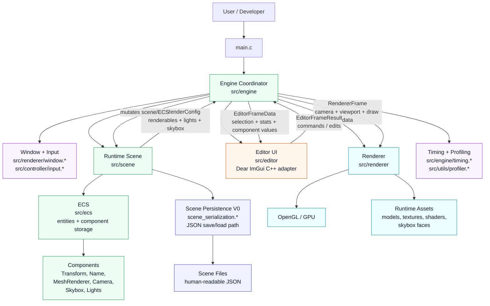
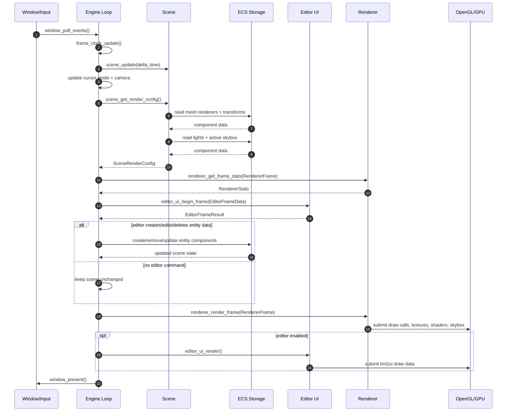

# Bour Engine Architecture

This document diagrams the current architecture in two ways:

- A 10,000-foot view of the major systems and ownership boundaries.
- A fine-grained view of the frame loop, data flow, and active module responsibilities.

The current architecture is intentionally mid-transition: renderer-owned demo state has mostly moved toward scene/ECS ownership, but some compatibility paths and legacy render data still exist while Scene Persistence V0 and editor workflow work continue.

## 10,000-Foot View



At this level, the rule is simple:

- `engine` coordinates the application.
- `scene` owns runtime authoring truth.
- `ecs` stores entity/component data.
- `renderer` owns rendering resources and consumes frame data.
- `editor` displays state and returns requested edits.
- `scene_serialization` turns scene data into durable files and back.

## Fine-Grained View

```mermaid
flowchart TD
    Main["main.c\nentry point"] --> Engine["engine.c\nEngineState + frame loop"]

    subgraph EngineState["EngineState owns / coordinates"]
        Window["GLFWwindow*"]
        RuntimeCamera["Camera\nactive runtime/editor camera"]
        RendererPtr["Renderer*"]
        SceneState["Scene"]
        Selection["selected_entity"]
        EditorFlags["editor_enabled\neditor_cursor_enabled"]
        Clock["FrameClock"]
        Profile["ProcessTimer values"]
    end

    Engine --> Window
    Engine --> RuntimeCamera
    Engine --> RendererPtr
    Engine --> SceneState
    Engine --> Selection
    Engine --> EditorFlags
    Engine --> Clock
    Engine --> Profile

    subgraph SceneModule["src/scene"]
        SceneInit["scene_init_default"]
        SceneUpdate["scene_update"]
        SceneExtract["scene_get_render_config"]
        SceneSaveLoad["scene_serialization.*"]
    end

    subgraph ECSModule["src/ecs"]
        Registry["EntityRegistry"]
        Storage["ComponentStorage"]
        Components["Transform, Name,\nMeshRenderer, Camera,\nSkybox, Lights"]
    end

    SceneState --> SceneInit
    SceneState --> SceneUpdate
    SceneState --> SceneExtract
    SceneState --> SceneSaveLoad
    SceneState --> Registry
    Registry --> Storage
    Storage --> Components

    subgraph EditorModule["src/editor"]
        EditorAPI["editor_ui.h\nC-facing API"]
        EditorImpl["editor_ui.cpp\nDear ImGui implementation"]
        EditorIn["EditorFrameData"]
        EditorOut["EditorFrameResult"]
    end

    Engine --> EditorIn
    EditorIn --> EditorAPI
    EditorAPI --> EditorImpl
    EditorImpl --> EditorOut
    EditorOut --> Engine
    Engine -- "applies edits" --> SceneState

    subgraph RendererModule["src/renderer"]
        RendererAPI["renderer.h\nopaque Renderer*"]
        RendererFrame["RendererFrame"]
        RenderData["renderer_data.h\nRenderableDrawData"]
        RenderTypes["mesh, model, texture,\nmaterial, lights, skybox,\nrender target"]
        Shaders["GLSL shaders"]
    end

    SceneExtract --> RenderData
    Engine --> RendererFrame
    RenderData --> RendererFrame
    RendererFrame --> RendererAPI
    RendererAPI --> RenderTypes
    RenderTypes --> Shaders
    RendererAPI --> GPU["OpenGL / GPU"]

    subgraph UtilityLayer["support"]
        Input["controller/input.*"]
        Timing["engine/timing.*"]
        Profiler["utils/profiler.*"]
        Helpers["math_utils\nfile_reader"]
    end

    Input --> Engine
    Timing --> Clock
    Profiler --> Profile
    Helpers --> Engine

    subgraph ExternalDeps["external dependencies"]
        GLFW["GLFW / GLAD"]
        CGLM["cglm"]
        STB["stb_image"]
        CGLTF["cgltf"]
        ImGui["Dear ImGui"]
        JSMN["jsmn"]
    end

    GLFW --> Window
    CGLM --> Components
    STB --> RenderTypes
    CGLTF --> RenderTypes
    ImGui --> EditorImpl
    JSMN --> SceneSaveLoad

    Trials["src/trials/odin/ecs_storage\nlanguage evaluation only"] -. "not active runtime" .-> ECSModule

    classDef engine fill:#f0fdf4,stroke:#16a34a,color:#111827
    classDef scene fill:#eef2ff,stroke:#4f46e5,color:#111827
    classDef editor fill:#fff7ed,stroke:#ea580c,color:#111827
    classDef render fill:#ecfeff,stroke:#0891b2,color:#111827
    classDef support fill:#f8fafc,stroke:#64748b,color:#111827
    classDef external fill:#faf5ff,stroke:#9333ea,color:#111827

    class Engine,Window,RuntimeCamera,RendererPtr,SceneState,Selection,EditorFlags,Clock,Profile engine
    class SceneInit,SceneUpdate,SceneExtract,SceneSaveLoad,Registry,Storage,Components scene
    class EditorAPI,EditorImpl,EditorIn,EditorOut editor
    class RendererAPI,RendererFrame,RenderData,RenderTypes,Shaders,GPU render
    class Input,Timing,Profiler,Helpers support
    class GLFW,CGLM,STB,CGLTF,ImGui,JSMN,Trials external
```



```text
Bour Engine runtime architecture
|
|-- Entry point
|   `-- src/main.c
|       `-- calls engine_run(fullscreen, fps_enabled, vsync_enabled)
|
|-- Engine coordinator: src/engine
|   |-- owns EngineState inside engine.c
|   |   |-- GLFWwindow*
|   |   |-- Camera camera
|   |   |-- Renderer* renderer
|   |   |-- Scene scene
|   |   |-- selected_entity
|   |   |-- editor_enabled / editor_cursor_enabled
|   |   |-- FrameClock
|   |   `-- per-frame ProcessTimer values
|   |
|   |-- startup responsibility
|   |   |-- initialize GLFW and window hints
|   |   |-- create window
|   |   |-- initialize camera
|   |   |-- scene_init_default(&scene)
|   |   |-- scene_get_render_config(&scene, &config)
|   |   |-- renderer_create()
|   |   |-- renderer_init(renderer, &RendererConfig)
|   |   `-- editor_ui_init(window)
|   |
|   |-- frame-loop responsibility
|   |   |-- update frame clock and optional FPS window title
|   |   |-- window_poll_events()
|   |   |-- scene_update()
|   |   |-- update editor cursor mode
|   |   |-- update active runtime/editor camera
|   |   |-- extract scene render data
|   |   |-- build editor frame data
|   |   |-- collect editor commands
|   |   |-- apply editor commands to scene/ECS
|   |   |-- render scene
|   |   |-- render editor UI
|   |   `-- present window
|   |
|   `-- shutdown responsibility
|       |-- editor_ui_shutdown()
|       |-- renderer_shutdown() / renderer_destroy()
|       |-- scene_shutdown()
|       |-- window_destroy()
|       `-- glfwTerminate()
|
|-- Runtime scene: src/scene
|   |-- Scene owns current runtime scene data
|   |   |-- default model path and skybox face paths
|   |   |-- active_camera EntityId
|   |   |-- active_skybox EntityId
|   |   |-- EntityRegistry
|   |   |-- component storage for transforms, names, mesh renderers
|   |   |-- component storage for directional, point, and spot lights
|   |   |-- component storage for cameras and skyboxes
|   |   |-- temporary/legacy light collections still used for defaults
|   |   `-- render extraction collections for point and spot lights
|   |
|   |-- scene_init_default()
|   |   |-- initializes entity registry and component storages
|   |   |-- sets default asset paths
|   |   |-- creates default model entity
|   |   |-- creates sun, point light, and spot light entities
|   |   |-- creates camera entity and assigns active_camera
|   |   `-- creates skybox entity and assigns active_skybox
|   |
|   |-- scene_get_render_config()
|   |   |-- extracts mesh renderers + transforms into RenderableDrawData[]
|   |   |-- extracts active skybox faces
|   |   |-- extracts first directional light
|   |   |-- extracts point and spot light collections
|   |   `-- returns SceneRenderConfig for engine/renderer handoff
|   |
|   `-- scene_serialization.*
|       |-- scene_save_to_file(scene, path)
|       |-- scene_load_from_file(scene, path)
|       |-- V0 parsed scene/entity structs
|       |-- result enums for IO, parse, version, and scene validation failures
|       `-- target file contract documented in notes/scene-format-v0.md
|
|-- ECS layer: src/ecs
|   |-- entity.h / entity.c
|   |   |-- EntityId
|   |   |-- INVALID_ENTITY_ID
|   |   |-- create entity
|   |   |-- destroy entity
|   |   `-- test whether entity is alive
|   |
|   |-- component_storage.*
|   |   |-- generic packed component storage
|   |   |-- add / remove / get by EntityId
|   |   |-- iterate by storage index
|   |   `-- track entity owner for stored component records
|   |
|   `-- components.*
|       |-- TransformComponent: position, rotation, scale, model matrix helper
|       |-- NameComponent: fixed-size editor/entity name
|       |-- MeshRendererComponent: model_path
|       |-- DirectionalLightComponent
|       |-- PointLightComponent
|       |-- SpotLightComponent
|       |-- CameraComponent
|       `-- SkyboxComponent
|
|-- Editor UI boundary: src/editor
|   |-- C-facing API in editor_ui.h
|   |-- C++ Dear ImGui implementation in editor_ui.cpp
|   |
|   |-- input from engine: EditorFrameData
|   |   |-- timing and FPS
|   |   |-- entity/renderable counts
|   |   |-- renderer loaded/submitted stats
|   |   |-- selected entity id/name
|   |   |-- selected transform values
|   |   |-- selected light values
|   |   |-- editor cursor state
|   |   |-- profiler timing values
|   |   `-- hierarchy item list
|   |
|   `-- output to engine: EditorFrameResult
|       |-- selection change
|       |-- toggle editor cursor
|       |-- rename selected entity
|       |-- create empty entity
|       |-- create renderable entity
|       |-- duplicate selected entity
|       |-- delete selected entity
|       |-- transform changed
|       `-- light changed
|
|-- Renderer: src/renderer
|   |-- renderer.h exposes opaque Renderer*
|   |-- renderer_init(RendererConfig)
|   |-- renderer_render_frame(RendererFrame)
|   |-- renderer_get_stats()
|   |-- renderer_get_frame_stats()
|   |
|   |-- RendererConfig at startup
|   |   |-- viewport
|   |   |-- camera pointer
|   |   |-- initial model path
|   |   |-- skybox faces
|   |   `-- initial light collections
|   |
|   |-- RendererFrame per frame
|   |   |-- camera pointer
|   |   |-- viewport size
|   |   |-- RenderableDrawData array
|   |   |-- directional light
|   |   |-- point light collection
|   |   `-- spot light collection
|   |
|   |-- renderer/data_types
|   |   |-- mesh, model, texture, material
|   |   |-- lightObject
|   |   |-- renderTarget
|   |   |-- skybox
|   |   `-- legacy render object / instancing types quarantined separately
|   |
|   `-- renderer/shaders
|       |-- lit, light, skybox, screen, and test shaders
|       `-- current target: finish Phong-era renderer through shadow maps
|
|-- Input, timing, utils
|   |-- src/controller/input.*
|   |   |-- movement axis
|   |   |-- smoothed movement axis
|   |   `-- mouse offset tracking
|   |
|   |-- src/engine/timing.*
|   |   `-- FrameClock and delta time
|   |
|   `-- src/utils
|       |-- profiler
|       |-- math_utils
|       `-- file_reader helper
|
|-- External dependencies
|   |-- GLFW / GLAD: windowing and OpenGL loading
|   |-- cglm: C math
|   |-- stb_image: image loading
|   |-- cgltf: glTF loading
|   |-- Dear ImGui: editor UI
|   `-- jsmn: JSON parsing for scene persistence
|
`-- Language trials
    `-- src/trials/odin/ecs_storage
        `-- learning/evaluation space, not active runtime architecture
```

## Frame Data Flow



```text
window events
    |
    v
engine_update()
    |-- scene_update()
    |-- editor cursor mode
    `-- camera movement/update
    |
    v
scene_get_render_config()
    |-- ECS mesh renderers + transforms -> RenderableDrawData[]
    |-- ECS lights -> renderer light collections
    `-- active skybox -> skybox face paths
    |
    +--> RendererFrame ----------------------+
    |       |-- camera                       |
    |       |-- viewport                     |
    |       |-- renderables                  |
    |       `-- lights                       |
    |                                       v
    |                                renderer_render_frame()
    |                                       |
    |                                       v
    |                                  OpenGL / GPU
    |
    +--> EditorFrameData --------------------+
            |-- hierarchy snapshot           |
            |-- selected component values    |
            |-- renderer stats               |
            `-- profiler values              |
                                            v
                                    editor_ui_begin_frame()
                                            |
                                            v
                                    EditorFrameResult
                                            |
                                            v
                              engine applies commands to Scene/ECS
```

## Current Ownership Rules

- The engine coordinates frame order, lifecycle, selected entity state, camera movement, editor command application, and render submission.
- The scene owns runtime entity/component state and extracts renderer-friendly data from ECS storage.
- The renderer owns OpenGL resources, shader/model/texture/skybox rendering behavior, and render statistics.
- The editor owns UI presentation and returns requested edits; it should not directly own scene truth.
- Scene persistence should serialize scene data, not renderer internals.

## Scene Persistence V0 Serializer Pressure

Scene Persistence V0 uses explicit JSON write, parse, validate, and apply code for each supported component type. This is intentional for the first durable scene format: the behavior is easy to inspect, debug, and change while the engine's runtime scene model is still stabilizing.

The tradeoff is repetition. Components such as transforms, mesh renderers, cameras, skyboxes, and lights each need their own serializer path:

- write runtime component data to JSON
- parse JSON fields into an intermediate representation
- validate required fields for that component
- apply parsed component data back into ECS storage
- preserve ownership for strings and other referenced data

That pattern is acceptable for V0, but it will not scale cleanly as more components are added. Future component-heavy work should consider a small metadata or reflection-like layer rather than continuing to duplicate the same serializer shape everywhere.

Candidate future direction:

- a component type registry
- per-component serializer descriptors
- write, parse, validate, and apply callbacks per component
- component-local schema version handling
- common helpers for vectors, colors, asset paths, optional fields, and required-field validation

This should remain a future cleanup path, not a blocker for V0 scene persistence. The near-term rule is still explicit code first, abstraction after the repeated shape is proven stable.

## Known Transitional Boundaries

- The engine still owns the active runtime/editor `Camera`, while `CameraComponent` and `active_camera` are present in the scene for persistence/editor bridging.
- Scene default setup still keeps some legacy/default light and asset paths while also creating ECS-backed entities/components.
- Scene persistence is V0 and still evolving; the durable format contract lives in `notes/scene-format-v0.md`.
- The editor is currently hierarchy-first; `notes/backlog.md` tracks viewport layout, viewport selection, transform tools, and editor workflow work.
- The renderer is still finishing the pre-PBR Phong path. PBR, terrain-scale procedural content, and advanced SDF rendering are intentionally deferred until the foundations are steadier.
