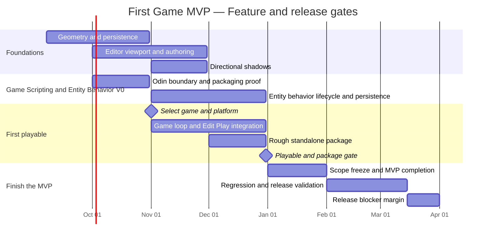

# First Game MVP — Calendar And Acceptance Tracker

Baseline reviewed September 7, 2026. The target is a small playable game, independently packaged and runnable without the editor or development checkout. Completion is measured by accepted behavior, not a commit number.

Sources: [backlog](backlog.md), [initiatives](initiative-backlog.md), and [MVP scope and historical context](first-game-mvp-plan.md). Historical pace of approximately 4.9 commits/week informed the original calendar, but it cannot measure feature complexity or provide a remaining-work burndown. The former commit quota and ideal commit-count curve are retired.

Target: playable loop and rough standalone package by December 2026; finish and validate the MVP during January–March 2027. March 31 is the planning deadline, not a guarantee. Reforecast after the scripting proof and each acceptance gate.

## Feature Gantt

Calendar bars are provisional windows for one developer's work. Overlapping workstreams share available time; they do not assume parallel staffing. Testing and documentation happen throughout.

The last bar includes March 31. January shifts from capability expansion to completing the chosen game. If December gates slip, reassess scope and dates explicitly rather than treating new-year cleanup as guaranteed to absorb unfinished systems.

## Acceptance Tracker

All entries below are planned or in progress, not accepted. Do not infer completion from a date passing.

| Workstream | Backlog / initiative mapping | Acceptance gate | Current status |
|---|---|---|---|
| Geometry and persistence | DS2, DS3 with DS3A; initiatives 1, 3, 5 | Render/create/save/load required geometry with explicit ownership. | In progress; path-pointer rebinding, five built-in primitives, primitive draw dispatch, statistics, and primitive-only startup are implemented. Persistence round trips, editor creation actions, and programmable meshes remain open. |
| Editor and renderer | DS3B, DS4/4A, minimum DS5/6/8, DS10; initiatives 2, 2A, 4 | Resize-safe usable viewport, input, selection/transforms, supported assignment, directional shadows. | Planned slices on existing editor alpha. |
| Game Scripting and Entity Behavior V0 | MVP game-code work package, DS9 integration; initiatives 1, 6, 7 | C-facing engine operations, entity-attached behavior identity/configuration, create/update/destroy lifecycle across load and Play/Stop, explicit ownership, packaged gameplay dependencies. | Planned; early proof needed. |
| Playable game | DS9 and MVP gameplay work package; initiatives 1, 6, 7 | Select one small game/platform, prove movement/collision/objective/result/restart and restoration on Stop. | Planned; game and platform not selected. |
| Standalone package | MVP package work package; initiatives 5, 7 | Repeatable executable/dependency/scene/shader/asset package; launch and finish outside the repository without editor/toolchain. | Planned; rough proof due in December. |
| Integration and release | DS7 and cross-cutting acceptance; initiatives 1, 2, 4, 5 | Repeated load/play/restart, clear errors, clean-environment playthrough, notices and launch instructions. | Planned; continuous checks before final release pass. |

Odin is the primary gameplay-language direction; Lua remains a fallback, not a simultaneous deliverable. Arbitrary custom components, hot reload, and general scripting-inspector tooling are outside V0 unless required by the selected game. Scriptable entities are now an explicit workstream rather than hidden inside gameplay time.

## Dependencies And Scope

- Correct the two known bugs before trusting geometry/persistence validation.
- Finish geometry drawing and resource ownership before depending on editor creation/save workflows.
- Establish resizing and viewport/input bounds before viewport-heavy interaction.
- Start the language-boundary proof in October, before the game depends on it. Reforecast if build, ownership, debugging, or packaging integration is harder than expected.
- Select the game and platform before gameplay-specific system expansion.
- Prove a rough standalone package in December; January finishes it.
- Freeze MVP scope in January. Defer optional content/polish first; explicitly agree any changes to required acceptance criteria.
- Preserve the manual implementation/review workflow and one small checkpoint per teaching exchange.

## Full Backlog Disposition

This mapping distinguishes scheduled work from later roadmap items so the chart does not imply the entire backlog fits inside this milestone.

| Backlog area | First Game MVP disposition |
|---|---|
| DS1 stabilization | Already delivered; regressions draw from stage E, not a fresh stabilization project. |
| DS2 persistence | Ownership correction and repeat validation in A; game reload regressions in C–E. |
| DS3 + DS3A | Required in A; CPU/GPU ownership, built-ins, programmable plane, editor/persistence, asset hygiene. |
| DS3B, DS4, DS4A | Required resize/input/viewport foundation in B; usability regression through E. |
| DS5 | Minimal supported geometry/asset assignment in B; no asset database. |
| DS6 | Minimum feedback, component visibility, dirty/delete behavior needed by the MVP in B/D. Multi-select/group editing and broad undo/redo can remain open unless essential to the selected game workflow. |
| DS7 | Documentation updated in every stage; final authoring and package guide in E. |
| DS8 | Minimal usable selection/transform interaction in B. Advanced gizmo polish is not required. |
| DS9 | Core Edit/Play isolation and standalone runtime in C, validated in E. |
| DS10 | Directional shadows in B. True visible/cull-surviving stats remain deferred until a real visibility path exists; loaded/submitted stats are sufficient for MVP reporting. |
| DS11 LOD | Deferred unless measurements show the small game requires a bounded remedy. |
| DS11A advanced SDF, DS12 terrain | Deferred; no speculative frontier allocation in this baseline. |
| Blank Scene / Project File Browser | Deferred. Choosing/loading the game scene and resolving packaged paths do not require a full browser or blank-project workflow. |
| Post-PBR flat profiling | Deferred. Existing diagnostics plus focused measurement serve the MVP. |
| Game-code, collision, game UI, standalone packaging | Promoted minimal work packages in C/D; scoped by the chosen game. |
| PBR, networking, general physics/scripting tooling, multi-platform/store distribution | Deferred. |

Initiatives 1, 2, 2A, 3, 4, and 5 drive the foundations and release. Initiative 6 funds only the bounded game-code integration; Initiative 7 funds only game-required runtime behavior. Initiative 1A reflection and Initiative 5A project browser remain deferred. Broad initiatives may stay active after First Game MVP even when their MVP slices pass.

## Progress Reviews

Review every two weeks and after a gate. Record demonstrated behavior, remaining concrete tasks, blockers, and a revised forecast. Preserve baseline dates for comparison. Build success alone does not establish graphical, lifetime, or package correctness.

| Review date | Accepted behavior / evidence | Remaining blockers | Forecast change |
|---|---|---|---|
| 2026-09-07 baseline | Primitive resource integration compiles; earlier editor and asset persistence paths exist. | Path ownership, plane winding, primitive drawing and later gates. | January–March release window; scripting proof is an explicit uncertainty. |
| Next review | — | — | — |

No numerical feature burndown is shown yet: tasks vary substantially in size, and there is no defensible estimate of total remaining effort. Once work is broken into reviewable, estimated tasks, track that effort separately from commit activity. Release when the MVP acceptance gates pass.
