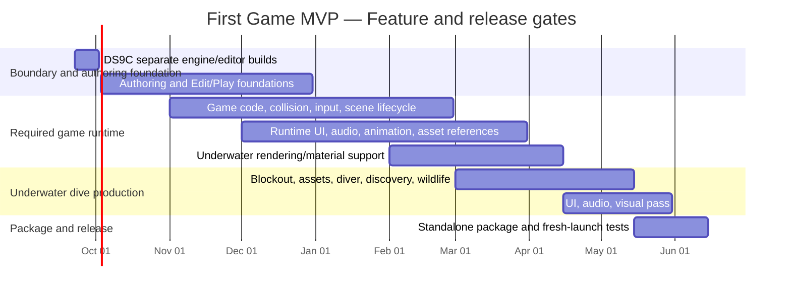

# First Game MVP — Calendar And Acceptance Tracker

Baseline reviewed September 7, 2026; revised September 25 after selecting the underwater-dive MVP and decomposing its required runtime work. The target is one compact underwater exploration dive, independently packaged and runnable without the editor or development checkout. Completion is measured by accepted behavior, not a commit number.

Sources: [backlog](backlog.md), [initiatives](initiative-backlog.md), and [MVP scope and historical context](first-game-mvp-plan.md). Historical pace of approximately 4.9 commits/week informed the original calendar, but it cannot measure feature complexity or provide a remaining-work burndown. The former commit quota and ideal commit-count curve are retired.

Current Linear target: June 15, 2027. Reforecast after the engine/editor boundary, scripting proof, and each acceptance gate. The target date is not a substitute for accepted behavior.

## Feature Gantt

Calendar bars are provisional windows for one developer's work. Overlapping workstreams share available time; they do not assume parallel staffing. Testing and documentation happen throughout.

The bars show dependencies and planning windows for one developer; overlap does not imply parallel staffing. If an upstream gate slips, reassess scope and dates explicitly rather than treating later integration time as guaranteed buffer.

## Acceptance Tracker

All entries below are planned or in progress, not accepted. Do not infer completion from a date passing.

| Workstream | Backlog / initiative mapping | Acceptance gate | Current status |
|---|---|---|---|
| Geometry and persistence | DS2, DS3 with DS3A; initiatives 1, 3, 5 | Render/create/save/load required geometry with explicit ownership. | Delivered; repeat validation remains part of integration testing. |
| Engine/editor boundary | DS9C; initiative 1 | `bour_engine` library with independently runnable `bour_game` and `bour_editor`, plus an opaque runtime boundary. | In progress. |
| Authoring and renderer | DS5/6/8/9, DS10, RYA-76, RYA-92; initiatives 2, 2A, 4, 5 | Enough scene authoring, runtime preview, asset-reference, material, and viewport capability to create the dive without editor/runtime leakage. | Planned after DS9C; advanced editor polish remains optional. |
| Game runtime | DS9A, DS9B, RYA-72 through RYA-75, RYA-91; initiatives 1, 6, 7 | Collision/query, game behavior, input, scene restart, runtime UI, audio, and animation playback with clean standalone ownership. | Planned; scripting proof is the largest uncertainty. |
| Underwater dive | RYA-82 through RYA-90 and RYA-92 | One bounded dive site, swim/discovery loop, wildlife, survey UI, audio, visual atmosphere, package, and playtest. | Design is selected; implementation is planned. |
| Standalone package | RYA-77, RYA-90, DS9C; initiatives 5, 7 | Repeatable `bour_game` distribution launches and completes outside the repository without editor code, Dear ImGui, or toolchain requirements. | Planned for final MVP stage. |
| Integration and release | DS7 and cross-cutting acceptance; initiatives 1, 2, 4, 5 | Repeated load/play/restart, clear errors, clean-environment playthrough, notices and launch instructions. | Planned; continuous checks before final release pass. |

Odin is the primary gameplay-language direction; Lua remains a fallback, not a simultaneous deliverable. Arbitrary custom components, hot reload, and general scripting-inspector tooling are outside V0 unless required by the selected game. Scriptable entities are now an explicit workstream rather than hidden inside gameplay time.

## Pre-game Delivery Audit — 2026-09-25

The foundation contains every capability currently required to make the selected dive. No new mandatory engine deliverable is needed before starting Game 1 production.

| Required capability | Existing delivery coverage | Boundary guard |
|---|---|---|
| Separate editor and game | DS9C / RYA-44 | Game never compiles, links, or initializes editor/ImGui code. |
| Authoring and temporary preview | DS5, DS6, DS8, DS9 | Advanced gizmos, broad undo/redo, project browsing, and apply-back remain non-required. |
| Collision, trigger, and targeting queries | DS9A / RYA-42 | Only bounded shapes, overlap/contact, and game-facing queries; no general physics breadth. |
| Game rules and wildlife behavior | DS9B / RYA-43, RYA-84 | One narrow scripting boundary and simple behavior profiles; no general AI framework. |
| Input and restartable scene lifecycle | RYA-75, RYA-74 | Named actions and explicit scene reload/startup; no full rebinding or streaming system. |
| Runtime presentation and feedback | RYA-72, RYA-73, RYA-87, RYA-88 | Runtime UI/audio remain independent of Dear ImGui and authoring tools. |
| Animated marine life | RYA-91, RYA-84 | Playback only; no animation editor, graphs, IK, retargeting, or blending system. |
| Project assets and packaging | RYA-76, RYA-77, RYA-86 | Normalized project-relative paths and one-platform packaging; no asset database/import pipeline. |
| Underwater visual target | RYA-92, RYA-89, optionally DS10 | Reusable fog/material controls first, game-specific tuning second; no water/ocean simulation. |

Two items need deliberate dependency links in Linear before activation: RYA-91 → RYA-84 and RYA-92 → RYA-89. RYA-76 should precede any asset-backed UI, audio, material, or packaging work. DS10 is not an MVP blocker unless the dive explicitly requires shadow maps; RYA-89 should use the available lighting/shadow capability rather than silently promoting DS10.

Not required for this MVP: persistent save games, settings/rebinding UI, controller support, generalized project manifests, full asset importing, navmeshes, terrain, water surfaces, or a formal game-build button inside the editor. RYA-74's configured startup scene and RYA-77's package configuration cover the minimum game-launch contract.

## Dependencies And Scope

- Correct the two known bugs before trusting geometry/persistence validation.
- Finish geometry drawing and resource ownership before depending on editor creation/save workflows.
- Complete DS9C before adding editor-specific selection or runtime behavior to the old application shape.
- Complete RYA-76 before separate MVP systems invent their own serialized asset-reference rules.
- Prove the scripting boundary before dive behavior/content depends on it. Reforecast if build, ownership, debugging, or packaging integration is harder than expected.
- Complete RYA-75 before the diver controller and RYA-72 before the survey UI.
- Complete RYA-91 before animated wildlife behavior and RYA-92 before the game-specific visual pass.
- Package and fresh-launch test before calling the dive complete; defer optional content/polish first if the target is at risk.
- Preserve the manual implementation/review workflow and one small checkpoint per teaching exchange.

## Full Backlog Disposition

This mapping distinguishes scheduled work from later roadmap items so the chart does not imply the entire backlog fits inside this milestone.

| Backlog area | First Game MVP disposition |
|---|---|
| DS1 stabilization | Already delivered; regressions draw from stage E, not a fresh stabilization project. |
| DS2 persistence | Ownership correction and repeat validation in A; game reload regressions in C–E. |
| DS3 + DS3A | Required in A; CPU/GPU ownership, built-ins, programmable plane, editor/persistence, asset hygiene. |
| DS3B, DS4, DS4A | Required resize/input/viewport foundation in B; usability regression through E. |
| DS5 | Minimal supported geometry/asset assignment; it contributes to authoring but does not replace RYA-76's cross-system asset-reference rule. |
| DS6 | Minimum feedback, component visibility, dirty/delete behavior. It is blocked by RYA-93's tagged-union refactor; multi-select/group editing and broad undo/redo can remain open unless essential to the dive workflow. |
| DS7 | Documentation updated in every stage; final authoring and package guide in E. |
| DS8 | Minimal usable selection/transform interaction in B. Advanced gizmo polish is not required. |
| DS9 + DS9C | DS9 provides Unity-like Edit/Play isolation: an authoring state and disposable runtime preview, with Play-mode changes discarded on Stop. DS9C creates `bour_engine` plus separate `bour_game` and `bour_editor` targets with a one-way editor-to-runtime dependency in C; runners own native presentation while runtime sessions render to supplied targets, validated in E. |
| DS10 | Directional shadows remain useful Phong-era renderer work, but are not an MVP blocker unless explicitly promoted by the underwater visual acceptance criteria. True visible/cull-surviving stats remain deferred until a real visibility path exists. |
| DS11 LOD | Deferred unless measurements show the small game requires a bounded remedy. |
| DS11A advanced SDF, DS12 terrain | Deferred; no speculative frontier allocation in this baseline. |
| Blank Scene / Project File Browser | Deferred. Choosing/loading the game scene and resolving packaged paths do not require a full browser or blank-project workflow. |
| Post-PBR flat profiling | Deferred. Existing diagnostics plus focused measurement serve the MVP. |
| Game-code, collision, input, scene lifecycle, game UI/audio, animation, asset references, underwater rendering, standalone packaging | Promoted bounded work packages for the selected underwater dive. |
| PBR, networking, general physics/scripting tooling, multi-platform/store distribution | Deferred. |

Initiatives 1, 2, 2A, 3, 4, and 5 drive the foundations and release. Initiative 6 funds only the bounded game-code integration; Initiative 7 funds only game-required runtime behavior. Initiative 1A reflection and Initiative 5A project browser remain deferred. Broad initiatives may stay active after First Game MVP even when their MVP slices pass.

## Progress Reviews

Review every two weeks and after a gate. Record demonstrated behavior, remaining concrete tasks, blockers, and a revised forecast. Preserve baseline dates for comparison. Build success alone does not establish graphical, lifetime, or package correctness.

| Review date | Accepted behavior / evidence | Remaining blockers | Forecast change |
|---|---|---|---|
| 2026-09-07 baseline | Primitive resource integration compiles; earlier editor and asset persistence paths exist. | Path ownership, plane winding, primitive drawing and later gates. | Original January–March release window; scripting proof is an explicit uncertainty. |
| 2026-09-25 MVP grooming | Underwater dive selected; Game 1 is decomposed into bounded runtime and game-specific work; DS9C is active. | Finish DS9C, add dependency links, then validate scripting and physics scope against the real dive. | Linear target is June 15, 2027. |
| Next review | — | — | — |

No numerical feature burndown is shown yet: tasks vary substantially in size, and there is no defensible estimate of total remaining effort. Once work is broken into reviewable, estimated tasks, track that effort separately from commit activity. Release when the MVP acceptance gates pass.
