# Road To Current Roadmap

This is a historical log of the work that led to the current Bour Engine roadmap and editor-foundation state. It is not the active backlog. Use `notes/backlog.md` for branch-sized deliverables and `notes/initiative-backlog.md` for long-term direction.

Dates are based on `git log`, planning-session records, and current note history. Durations are approximate unless a commit range makes the elapsed time obvious. "Work time" here means calendar span visible in project history, not uninterrupted hours at the keyboard.

## Summary Timeline

- 2026-03-11 to 2026-03-24: project bootstrap, notes, README, initial renderer, shader files, mesh/VBO/EBO foundations, and basic window/render loop cleanup.
- 2026-03-27 to 2026-04-10: textures, cglm migration, render objects, transforms, camera movement, mouse look, and first light object setup.
- 2026-04-17 to 2026-06-24: LearnOpenGL lighting/materials work, maps, multiple light types, render-loop cleanup, and first serious renderer separation.
- 2026-06-25 to 2026-07-08: cgltf model loading, diagnostics, blending/depth/culling, skybox, instancing, framebuffer/MSAA, Blinn-Phong, and gamma correction.
- 2026-07-22 to 2026-07-26: architecture breakpoint, window/render lifecycle exposure, engine coordinator, engine state, and camera ownership migration.
- 2026-07-26 to 2026-07-31: editor-foundation planning, language-trial guardrails, renderer/scene ownership cleanup, ECS, and renderer frame-data extraction.
- 2026-08-03 to 2026-08-07: Dear ImGui editor alpha, hierarchy, inspector, transform/light editing, runtime entity creation, duplication, deletion, and cursor/camera interaction.
- 2026-08-08 to 2026-08-11: editor-alpha cleanup, profiling/statistics work, licensing cleanup, and backlog grooming.
- 2026-08-11 to 2026-08-16: Scene Persistence V0 schema, active scene references, entity/name/transform serialization, runtime scene save serialization, and roadmap expansion.
- 2026-08-12 to 2026-08-17: SDF roadmap anchors, initiative backlog, editor layout/viewport direction, and reflection initiative.

## Elapsed Time At A Glance

- Repo bootstrap to current roadmap state: about 161 calendar days, from 2026-03-11 through 2026-08-18.
- First renderer to gamma-corrected/model-capable renderer: about 112 calendar days, from 2026-03-19 through 2026-07-08.
- Architecture transition from renderer demo state toward engine/editor ownership: about 10 calendar days, from 2026-07-22 through 2026-07-31.
- First editor alpha implementation: about 5 calendar days, from 2026-08-03 through 2026-08-07.
- Editor-alpha cleanup and measurement pass: about 4 calendar days, from 2026-08-08 through 2026-08-11.
- Scene persistence implementation/planning burst: about 6 calendar days, from 2026-08-11 through 2026-08-16.
- Current planning-doc refinement burst: about 6 calendar days, from 2026-08-12 through 2026-08-17.

## Scale Map

```mermaid
flowchart TD
    A["Mar 11\nRepo + notes\n1 day"] --> B["Mar 19-24\nRenderer bootstrap\n6 days"]
    B --> C["Mar 27-Apr 10\nTextures, math, objects,\ncamera, first light\n15 days"]
    C --> D["Apr 17-Jun 24\nLighting, materials, maps,\nmultiple lights, cleanup\n69 days calendar"]
    D --> E["Jun 25-Jul 8\ncgltf, skybox, instancing,\nframebuffer, Blinn-Phong, gamma\n14 days"]
    E --> F["Jul 22-26\nArchitecture breakpoint,\nengine coordinator, engine state\n5 days"]
    F --> G["Jul 26-31\nEditor foundation plan,\nscene ownership, ECS,\nrenderer frame extraction\n6 days"]
    G --> H["Aug 3-7\nEditor alpha:\nImGui, hierarchy, inspector,\ncreate/duplicate/edit\n5 days"]
    H --> I["Aug 8-11\nAlpha cleanup,\nprofiling, stats, license,\nbacklog grooming\n4 days"]
    I --> J["Aug 11-16\nScene Persistence V0:\nschema, active refs,\nsave serialization\n6 days"]
    J --> K["Aug 12-17\nRoadmap refinement:\nSDF, initiatives,\nviewport UX, reflection\n6 days"]
    K --> L["Current roadmap\nEditor Foundation active"]

    A:::base
    B:::render
    C:::render
    D:::render
    E:::render
    F:::arch
    G:::arch
    H:::editor
    I:::cleanup
    J:::persist
    K:::plan
    L:::current

    classDef base fill:#eef2ff,stroke:#4f46e5,color:#111827
    classDef render fill:#ecfeff,stroke:#0891b2,color:#111827
    classDef arch fill:#f0fdf4,stroke:#16a34a,color:#111827
    classDef editor fill:#fff7ed,stroke:#ea580c,color:#111827
    classDef cleanup fill:#f8fafc,stroke:#64748b,color:#111827
    classDef persist fill:#fef2f2,stroke:#dc2626,color:#111827
    classDef plan fill:#faf5ff,stroke:#9333ea,color:#111827
    classDef current fill:#fefce8,stroke:#ca8a04,color:#111827
```



Grand design tree:

```text
Bour Engine grand design, 2026-03-11 to 2026-08-18
|
|-- NORTH STAR
|   `-- C-first, editor-capable, scene-authored 3D engine
|       |-- runtime ownership is explicit
|       |-- saved scene data is reusable
|       |-- renderer consumes scene/ECS frame data
|       `-- higher-level gameplay/customization can live above the core later
|
|-- COMPLETED FOUNDATION: graphics and renderer capability
|   |-- 1. Repo and project frame, about 1 day
|   |   |-- repo, notes, README, CMake tech-stack notes
|   |   `-- created the habit of durable planning docs
|   |
|   |-- 2. First renderer, about 6 days
|   |   |-- window/render loop, shader files, FPS/resizing
|   |   |-- VBO/EBO, mesh generation, winding, culling setup
|   |   `-- unlocked: drawing real indexed geometry
|   |
|   |-- 3. Interactive render basics, about 15 days
|   |   |-- textures, cglm migration, render objects
|   |   |-- transforms, perspective projection, camera movement
|   |   `-- unlocked: movable 3D scene instead of a static object
|   |
|   |-- 4. Phong-era renderer climb, about 69 calendar days
|   |   |-- lighting, lamps, materials, diffuse/specular maps
|   |   |-- directional lights, point lights, spot lights
|   |   |-- render loop cleanup and light code moved out of renderer.c
|   |   `-- unlocked: enough visual richness to expose renderer sprawl
|   |
|   `-- 5. Model/render feature expansion, about 14 days
|       |-- cgltf loading, diagnostics, depth/blending/culling
|       |-- skybox, instancing, camera UBO, framebuffer, MSAA
|       |-- Blinn-Phong and gamma correction
|       `-- unlocked: real test scenes and the need for scene ownership
|
|-- COMPLETED FOUNDATION: runtime ownership and editor alpha
|   |-- 6. Engine coordinator turn, about 5 days
|   |   |-- window lifecycle and renderer frame lifecycle boundaries
|   |   |-- engine coordinator, engine state, camera ownership
|   |   `-- unlocked: one place to coordinate window, input, render, editor
|   |
|   |-- 7. Scene/ECS ownership turn, about 6 days
|   |   |-- default scene config and scene lifecycle
|   |   |-- ECS entity registry and component storage
|   |   |-- transforms, names, mesh renderers, cameras, lights
|   |   |-- renderer frame packets extracted from ECS/scene data
|   |   `-- unlocked: renderer no longer has to be authoring truth
|   |
|   |-- 8. Editor alpha, about 5 days
|   |   |-- Dear ImGui lifecycle through a C-facing boundary
|   |   |-- editor mode, hierarchy, inspector, stats/actions/camera panels
|   |   |-- select, inspect, transform edit, light edit
|   |   |-- create, duplicate, delete, cursor/camera interaction
|   |   `-- unlocked: hierarchy-first authoring surface
|   |
|   `-- 9. Stabilization pass, about 4 days
|       |-- extracted selection gathering and editor action handlers
|       |-- guarded entity actions and quarantined legacy renderer data
|       |-- profiler averages/warnings and loaded/submitted geometry stats
|       |-- Apache 2.0 license and asset/license backlog cleanup
|       `-- unlocked: cleaner base for persistence and workflow work
|
|-- ACTIVE MILESTONE: Editor Foundation
|   |
|   |-- Initiative 1: Runtime Ownership And Scene Truth
|   |   |-- DS2: Scene Persistence V0
|   |   |   |-- done: V0 schema, active refs, save serialization start
|   |   |   |-- next: load path, save/load/render validation, editor actions
|   |   |   `-- unlocks: reusable scene-authored data
|   |   |
|   |   |-- DS6: Scene Editing Workflow V1
|   |   |   |-- dirty state, protected deletes, component summaries
|   |   |   `-- unlocks: editor workflows that feel intentional
|   |   |
|   |   `-- DS9: Editor Play/Simulation Separation
|   |       |-- edit state separated from update/simulation state
|   |       `-- unlocks: safer authoring without gameplay always running
|   |
|   |-- Initiative 1A: Component Metadata And Reflection
|   |   |-- DS2 note: capture serializer boilerplate during V0
|   |   |-- later: component descriptors, defaults, validation, generic JSON
|   |   `-- unlocks: custom components and less bespoke serializer/UI code
|   |
|   |-- Initiative 2: Editor As A Real Authoring Tool
|   |   |-- DS4: Editor Camera And Input V1
|   |   |   |-- viewport-focused camera control and text-field safety
|   |   |   `-- unlocks: camera/input that does not fight ImGui
|   |   |
|   |   |-- DS4A: Editor Layout Foundation V0
|   |   |   |-- dedicated viewport bounds and predictable surrounding panels
|   |   |   `-- unlocks: picking, gizmos, asset previews, documentation screenshots
|   |   |
|   |   |-- DS5: Asset And Mesh Assignment V0
|   |   |   |-- known asset list and mesh-renderer assignment
|   |   |   `-- unlocks: authoring renderable entities without C edits
|   |   |
|   |   |-- DS7: Editor User Documentation V0
|   |   |   |-- controls, panels, workflows, limitations, manual tests
|   |   |   `-- unlocks: editor behavior can be used and tested alongside dev
|   |   |
|   |   `-- DS8: Viewport Selection And Transform Tools
|   |       |-- direct viewport selection and transform handles
|   |       `-- unlocks: object placement without hierarchy-only editing
|   |
|   |-- Initiative 2A: Editor Workspace And Viewport UX
|   |   |-- depends on DS4 and DS4A
|   |   |-- short-term: simple stable viewport-centered layout
|   |   |-- later: docking, saved layouts, tabs, multi-window polish
|   |   `-- unlocks: industry-standard editor shape without taking it all now
|   |
|   |-- Initiative 3: Engine-Owned Geometry And Procedural Content
|   |   |-- DS3: Engine-Owned Primitive And Programmable Geometry
|   |   |   |-- primitives, programmable mesh ownership, save/load support
|   |   |   `-- unlocks: less dependence on third-party test assets
|   |   |
|   |   |-- DS3A: Initial SDF Generated Meshes
|   |   |   |-- CPU SDF-to-ordinary-mesh path through programmable meshes
|   |   |   `-- unlocks: SDF without a new renderer yet
|   |   |
|   |   |-- DS11: Level Of Detail And Render Budget Controls
|   |   |   |-- cost visibility and resource scaling
|   |   |   `-- unlocks: terrain and heavy generated geometry without guesswork
|   |   |
|   |   |-- DS11A: Advanced SDF Rendering And Workflows
|   |   |   |-- raymarching/GPU/hybrid decisions after budgets exist
|   |   |   `-- unlocks: advanced SDF without quietly exploding cost
|   |   |
|   |   `-- DS12: Terrain Entity And Procedural Terrain
|   |       |-- terrain as first-class scene/render data
|   |       `-- unlocks: large procedural worlds on top of explicit budgets
|   |
|   |-- Initiative 4: Renderer Capability Without Renderer Sprawl
|   |   |-- DS10: Phong Shadow Maps
|   |   |   |-- depth pass, shadow map resources, debug/validation
|   |   |   `-- unlocks: completion of pre-PBR LearnOpenGL renderer target
|   |   |
|   |   `-- Later: PBR materials and image-based lighting
|   |       `-- deferred until scene/editor/render foundations can hold it
|   |
|   |-- Initiative 5: Asset Pipeline And Distribution Hygiene
|   |   |-- DS3: engine-owned geometry reduces external asset pressure
|   |   |-- DS5: known asset assignment starts small
|   |   |-- license cleanup separates Apache code/docs from third-party assets
|   |   `-- unlocks: project can eventually be shared without asset ambiguity
|   |
|   `-- Initiative 6: Language And Customization Boundaries
|       |-- language-trials.md keeps Odin, Zig, and C++ experiments scoped
|       |-- Odin: future game-level customization and custom components
|       |-- Zig/C++: serialization, validation, import, or editor tooling boundaries
|       `-- unlocks: learning and future flexibility without rewriting the core now
|
`-- DEFERRED UNTIL FOUNDATION HOLDS
    |-- PBR and image-based lighting
    |-- physics, audio, networking, packaging
    |-- full asset database/import pipeline
    |-- advanced scripting/custom component bridge
    `-- polished multi-window editor workspace
```

## Step 1: Bootstrap The Repository And Notes

Date: 2026-03-11.

Approximate duration: one day.

What happened:

- Created the initial repository state.
- Added initial notes.
- Established the early project shape before renderer work began.

Representative commits:

- `8c5b09f`: initial commit.
- `c062639`: initial notes.

Why it mattered:

This gave the project a durable place to record both code and planning. The notes directory existed from the beginning, which later made backlog and roadmap work feel natural instead of bolted on.

## Step 2: Build The First Renderer Foundations

Date: 2026-03-19 to 2026-03-24.

Approximate duration: about 6 calendar days.

What happened:

- Added the initial renderer.
- Moved shaders into their own files.
- Added FPS counter and resizing behavior.
- Cleaned up public APIs and error handling.
- Started input-system work.
- Added README and CMake tech-stack notes.
- Added mesh/TODO planning, multi-VBO mesh generation, winding/culling setup, and EBO implementation.

Representative commits:

- `4b3ad33`: initial renderer.
- `bdda00c`, `9cf8e57`: shader-file organization.
- `c85e100`: FPS counter and resizing.
- `a89c7aa`: clearer naming, error handling, and public APIs.
- `b6fc5be`: initial input system.
- `6e16b60`, `e252f2c`, `2c6d0c7`: README and tech-stack notes.
- `bc6deb2`, `237152d`, `502be58`: mesh/VBO/EBO and renderer-state setup.

Why it mattered:

This was the first working graphics foundation: windowing, shaders, render state, mesh data, and indexed drawing. Later engine/editor work all grew out of this base.

## Step 3: Add Textures, Math, Render Objects, Camera, And First Light Setup

Date: 2026-03-27 to 2026-04-10.

Approximate duration: about 15 calendar days.

What happened:

- Added texture support.
- Added cglm and migrated vector/math usage to it.
- Moved from a single object path to render objects.
- Refactored model-matrix updates.
- Added perspective projection and multiple objects with different transforms.
- Cleaned up mesh ownership.
- Added orbit camera, keyboard camera movement, mouse handling, mouse camera control, and camera settings updates.
- Initialized the first light class/object direction.
- Continued renderer and shader cleanup.

Representative commits:

- `7be93de`, `72095d`, `b5c4b75`: textures and cglm.
- `7af0cd1`, `8071add`, `0d272cf`: render-object transition and model-matrix refactors.
- `349455c`: perspective projection and multiple transformed objects.
- `2aafc16`: mesh ownership cleanup.
- `4f4f24c`, `527b4d0`, `be4d1bd`, `7d9d93d`, `2d0f434`: camera and input control.
- `667e4cb`, `9e7564a`: lighting start and renderer cleanup.

Why it mattered:

The renderer moved from "draw something" toward a reusable scene-like setup: objects, transforms, camera movement, and the first lighting concepts.

## Step 4: Build Out Lighting, Materials, Maps, And Renderer Cleanup

Date: 2026-04-17 to 2026-06-24.

Approximate duration: about 69 calendar days, with a visible pause between 2026-04-17 and 2026-06-13.

What happened:

- Added lighting.
- Added lamp creation and materials.
- Added Windows initialization changes.
- Added diffuse and specular maps.
- Added directional, point, and spot lights.
- Added multiple point lights and multiple spot lights.
- Moved render-object drawing into dedicated files.
- Cleaned up the render loop.
- Moved most light handling out of `renderer.c`.
- Added TODO planning and renderer-init helper cleanup.

Representative commits:

- `575ed9a`: lighting.
- `5837d59`: lamp creation.
- `88990a4`: materials.
- `409613f`, `32b4bc4`, `c3c9fe2`: Windows changes and maps.
- `a95cffb`, `8242013`, `7c3fa4f`, `ffed6ce`, `cd8620d`: directional/point/spot/multiple lights.
- `60fe4d2`, `276f5da`, `16948c1`: render-object and render-loop cleanup.
- `d0e201f`, `5b27519`, `c800620`: moving light code out of renderer and cleanup.

Why it mattered:

This phase completed much of the classic Phong-era renderer groundwork. It also began exposing the renderer sprawl that later motivated engine-owned scene state and editor-friendly frame data.

## Step 5: Add Model Loading, Skybox, Instancing, Framebuffer, Blinn-Phong, And Gamma

Date: 2026-06-25 to 2026-07-08.

Approximate duration: about 14 calendar days.

What happened:

- Added geometry/model loading through cgltf.
- Completed the cgltf implementation and added better model-loading diagnostics.
- Added face culling, blending, and depth testing.
- Added interleaved VBOs and a cubemap skybox.
- Added instancing.
- Added camera UBO, framebuffer, and antialiasing.
- Added a debug lighting scene and Blinn-Phong.
- Added gamma correction.

Representative commits:

- `52de323`, `ce7744d`, `2e9b18e`: cgltf model loading and diagnostics.
- `83f7478`: face culling, blending, and depth testing.
- `74bde74`: interleaved VBOs and cubemap skybox.
- `a563cc9`: instancing.
- `8301e8f`: camera UBO, framebuffer, and antialiasing.
- `0b80416`: debug lighting scene and Blinn-Phong.
- `082ab22`: gamma correction.

Why it mattered:

The renderer became capable enough to support real-looking test scenes, but it was still organized around hardcoded/demo-oriented state. That tension set up the next architecture pass.

## Step 6: Mark The Architecture Breakpoint

Date: 2026-07-22.

Approximate duration: one documentation checkpoint.

What happened:

- Added `notes/wip.md` as a breakpoint.
- Captured the sense that the project was ready to move from renderer feature accumulation into architecture and editor foundation.

Representative commit:

- `73c44a4`: added `wip.md` for breakpoint.

Why it mattered:

This was the hinge between graphics-feature learning and engine/editor architecture. From here, the project started asking who owns state, who coordinates frames, and how scene data should become real.

## Step 7: Introduce Engine Coordinator And Move Camera Toward Engine Ownership

Date: 2026-07-24 to 2026-07-26.

Approximate duration: about 3 calendar days.

What happened:

- Exposed window lifecycle operations.
- Exposed renderer frame lifecycle.
- Moved the application loop into an engine coordinator.
- Established an engine coordinator module.
- Introduced explicit engine state.
- Moved camera ownership toward the engine.

Representative commits:

- `c2b2ce6`: expose window lifecycle operations.
- `4eab2ab`: expose renderer frame lifecycle.
- `3a2f97a`: move application loop into engine coordinator.
- `f9e2f30`: establish engine coordinator module.
- `06de0b3`: introduce engine state.
- `44be4e1`: move camera to engine ownership.

Why it mattered:

The engine needed a real coordinator before an editor could coexist with rendering. This step started pulling control flow out of renderer/demo code and into engine-owned state.

## Step 8: Define The Editor Foundation Direction

Date: 2026-07-26 to 2026-07-27.

Approximate duration: one planning session, then committed the next day.

What happened:

- Reframed the next major project push around an editor foundation rather than isolated renderer work.
- Established that the active milestone should cover engine ownership, scene management, ECS, UI/editor shell, editor interaction, and finishing the Phong-era renderer through shadow maps.
- Explicitly deferred PBR so it would not crowd the editor foundation.
- Added language-evaluation hooks without letting language trials become a rewrite milestone.
- Created `notes/language-trials.md` for Odin, C++, and Zig subsystem candidates.
- Clarified in the README that AI can assist with documentation, backlog organization, and project management while preserving the no-AI-written-code stance.

Deliverables created or changed:

- `notes/backlog.md`
- `notes/language-trials.md`
- `README.md`

Why it mattered:

This gave the project a focused near-term target: make the engine editor-capable before expanding into larger runtime systems or renderer ambitions.

## Step 9: Move Ownership Out Of Renderer Debug State

Date: 2026-07-27 to 2026-07-28.

Approximate duration: about 2 calendar days.

What happened:

- Passed renderer frame data explicitly.
- Introduced an engine frame clock.
- Made renderer ownership explicit from the engine side.
- Initialized renderer state from viewport and scene-derived configuration instead of hidden debug globals.
- Added basic scene lifecycle hooks.
- Introduced default scene configuration.
- Passed debug render assets through configuration.
- Moved default/debug scene setup out of renderer-owned code.

Representative commits:

- `f7a005c`: renderer ownership and project-management update.
- `4c6094a`: pass renderer frame data explicitly.
- `44674ce`: renderer initialization from viewport data.
- `d838010`: engine frame clock.
- `06fcfbb`, `32261c4`, `efcfac1`, `c6e403d`, `75923c1`, `9f4ded0`: scene lifecycle, config, default scene setup, and backlog/API cleanup.

Why it mattered:

The editor could not become authoritative while renderer code still owned demo-state truth. This step made the later ECS and save/load work possible.

## Step 10: Add The ECS And Scene-Owned Runtime Data

Date: 2026-07-29 to 2026-07-31.

Approximate duration: about 3 calendar days.

What happened:

- Added an ECS entity registry.
- Added component definitions and transform storage.
- Added generic component storage.
- Clarified language-trial direction after seeing the shape of ECS/editor work.
- Converted default scene setup to ECS entities.
- Extracted ECS light and mesh-renderer data into renderer-friendly frame data.
- Added Git LFS for large assets during the asset/render extraction work.
- Removed stale renderer model-matrix ownership.
- Redefined backlog language around the new scene/render boundary.

Representative commits:

- `ec5d4c4`: ECS entity registry.
- `9bcaf69`, `2794211`: component definitions, transform storage, and generic ECS storage.
- `c333919`: language-trial direction.
- `feae2a2`, `21e59ef`, `ffbb603`, `4d97557`, `5bd1f86`, `5b2d919`: ECS-backed default scene, renderer frame extraction, asset/LFS cleanup, and stale renderer ownership removal.

Why it mattered:

This created the runtime shape that the editor and scene persistence would later target: entities, components, scene-owned resources, and renderer input packets.

## Step 11: Build The First Hierarchy-First Editor Alpha

Date: 2026-08-03 to 2026-08-07.

Approximate duration: about 5 calendar days.

What happened:

- Proved ECS transform updates reached the renderer.
- Clarified editor foundation update boundaries.
- Added Dear ImGui lifecycle integration through a C-facing editor boundary.
- Added editor mode lifecycle gating.
- Added editor panels for hierarchy, inspector, timing/status, scene actions, and camera settings.
- Added hierarchy selection.
- Added transform editing in the inspector.
- Added editor cursor mode and transform editing refinements.
- Added runtime entity creation and duplication.
- Added selected light editing.
- Completed editor alpha interactions.

Representative commits:

- `88a01c0`, `2dd9344`, `bb1813b`, `159709f`, `97686aa`, `df67195` on 2026-08-03.
- `eec259b` on 2026-08-06.
- `5c4e88f`, `16f21f9`, `6a1d44e` on 2026-08-07.

Why it mattered:

This was the first visible editor slice. It turned the roadmap from architecture cleanup into an interactive authoring surface, with creation, duplication, selection, inspection, transform editing, light editing, and camera/cursor interaction.

## Step 12: Stabilize The Editor Alpha And Add Measurement Tools

Date: 2026-08-08 to 2026-08-11.

Approximate duration: about 4 calendar days.

What happened:

- Simplified renderer light uploads and editor UI layout.
- Extracted editor selection data and shared float helpers.
- Extracted editor action handlers.
- Guarded editor entity actions.
- Quarantined legacy renderer data types.
- Created the Apache 2.0 license file.
- Added profiler averages, warning thresholds, and loaded/submitted renderer geometry stats.
- Groomed the backlog around serialization formatting and licensing.

Representative commits:

- `5ab443a`, `2d6084d`, `3ae6b54`, `b57e3fc`, `09fb58f` on 2026-08-08.
- `7ac6f3f`, `1d87616`, `912bff2` on 2026-08-09.
- `48773c9`, `ab92d73`, `f6c3ba7`, `8f04488` on 2026-08-11.

Why it mattered:

The first editor alpha was usable enough to reveal cleanup needs. This pass reduced immediate friction before deeper persistence and scene workflow work piled onto the same areas.

## Step 13: Define Scene Format V0

Date: planning decisions recorded from 2026-07-22 work, then reinforced in 2026-08-11 to 2026-08-13 commits.

Approximate duration: one schema/planning session plus follow-up implementation commits.

What happened:

- Created `notes/scene-format-v0.md` as the authoritative scene-format reference.
- Chose human-readable JSON for V0.
- Required `version`, `active_camera`, `active_skybox`, and `entities`.
- Decided entity IDs must be saved and restored rather than silently remapped.
- Required active camera and active skybox references as real scene state.
- Modeled entities as multi-component records to match the ECS and leave room for custom/script components.
- Defined fail-soft loader behavior for malformed entity data where possible.
- Documented that loaded strings must be copied into owned runtime storage.

Deliverables created or changed:

- `notes/scene-format-v0.md`
- Scene-persistence entries in `notes/backlog.md`

Why it mattered:

This made persistence concrete. The save/load work now has a target format that reflects the real ECS/runtime model instead of temporary renderer state.

## Step 14: Add Active Scene References And Save Serialization

Date: 2026-08-13 to 2026-08-16.

Approximate duration: about 4 calendar days from first scene-schema commit to current save-serialization commit.

What happened:

- Added active scene references needed by the V0 file format.
- Added entity/name/transform serialization work.
- Added a runtime scene save serialization path.
- Kept the first implementation small enough to compile while acknowledging that full load and full round-trip validation are still pending.
- Updated roadmap language around Scene Persistence V0 so save, load, round-trip validation, editor actions, and scene reload/switching remain explicit.

Representative commits:

- `1593a5d`: scene persistence schema and active scene refs.
- `a3330b4`: serialize scene entities with names and transforms.
- `be8ca85`: runtime scene save serialization and backlog expansion.

Current state:

- Scene Persistence V0 has a defined schema.
- Save serialization has started.
- Load path, save/load round-trip validation, editor save/load actions, and scene switching/reload remain open in `notes/backlog.md`.

Why it mattered:

This moved scene persistence from planning into the first real implementation slice while keeping the remaining work visible.

## Step 15: Add Editor Documentation, Geometry, LOD, Terrain, And Licensing Roadmap Decisions

Date: decisions recorded in 2026-07-22 planning and reflected in August backlog state.

Approximate duration: one planning session plus follow-up backlog grooming.

What happened:

- Added `Deliverable Set 7: Editor User Documentation V0`.
- Treated editor documentation as a first-class deliverable that should evolve alongside editor-facing changes.
- Moved engine-owned primitives and programmable geometry earlier to reduce third-party asset dependence.
- Kept terrain as a separate larger deliverable.
- Inserted Level Of Detail And Render Budget Controls before terrain so terrain-scale work has a cost model first.
- Clarified that public distribution should separate project-authored Apache 2.0 code/docs from third-party test assets and dependencies.

Why it mattered:

The roadmap now accounts for usability, distribution hygiene, and performance prerequisites instead of only listing exciting engine features.

## Step 16: Add Explicit SDF Roadmap Anchors

Date: 2026-08-12.

Approximate duration: one focused planning/editing session.

What happened:

- Analyzed whether existing DS3, DS11, and DS12 work fully unlocked SDF.
- Concluded that the roadmap had the right foundations but no explicit SDF milestones.
- Added `Deliverable Set 3A: Initial SDF Generated Meshes` after DS3.
- Added `Deliverable Set 11A: Advanced SDF Rendering And Workflows` after DS11.
- Preserved existing deliverable numbering by using suffixes instead of renumbering the whole backlog.

Why it mattered:

This split SDF into a conservative first slice and a later advanced renderer/workflow slice. Initial SDF can be ordinary generated mesh data; raymarching, GPU volumes, advanced composition, and terrain-scale workflows wait until the engine has the right foundations.

## Step 17: Split Deliverables From Initiative-Level Direction

Date: 2026-08-15 to 2026-08-17.

Approximate duration: one main planning-doc session plus later refinement.

What happened:

- Created `notes/initiative-backlog.md` as the long-term north-star planning file.
- Kept `notes/backlog.md` as the canonical branch-sized deliverable checklist.
- Added initiative-level sequencing rules around runtime ownership, editor authoring, procedural content, renderer boundaries, asset hygiene, language boundaries, and deferred runtime systems.
- Made it explicit that the initiative file should be re-read when backlog items are added, removed, or reordered.

Why it mattered:

This fixed a planning-structure problem: one file no longer has to be both the immediate execution checklist and the long-term design compass.

## Step 18: Add Short-Term Editor Layout Foundation And Long-Term Viewport UX Initiative

Date: 2026-08-15 to 2026-08-17.

Approximate duration: same planning pass as the initiative split.

What happened:

- Added `Deliverable Set 4A: Editor Layout Foundation V0` to `notes/backlog.md`.
- Added `Initiative 2A: Editor Workspace And Viewport UX` to `notes/initiative-backlog.md`.
- Captured the short-term need for a stable viewport area and predictable surrounding panels.
- Captured the long-term direction of an industry-standard editor workspace with the game/scene view inside a dedicated viewport and tool windows around it.
- Deferred full docking, saved layouts, tabbed panels, multi-window support, and theming polish.

Why it mattered:

Many later editor features need a trustworthy viewport boundary: camera capture, picking, transform gizmos, asset previews, scene workflow feedback, and documentation screenshots.

## Step 19: Add Reflection As A Later Initiative, Not A Scene Persistence Blocker

Date: 2026-08-15 to 2026-08-17.

Approximate duration: short follow-up planning change during the same roadmap pass.

What happened:

- Added `Initiative 1A: Component Metadata And Reflection` to `notes/initiative-backlog.md`.
- Added a small Scene Persistence V0 note to track serializer boilerplate and future metadata/reflection needs.
- Framed reflection as an explicit C-first metadata layer for field descriptors, defaults, validation, editor exposure, and generic serialization.
- Kept reflection out of the immediate Scene Persistence V0 critical path.

Why it mattered:

Scene serialization was already showing signs of repeated component-specific boilerplate, but stopping V0 to build a reflection system would delay the first truthful save/load path. The roadmap now records the need without letting it block the next slice.

## Current Roadmap State

As of 2026-08-18, the roadmap is organized as:

- `notes/backlog.md`: branch-sized deliverable sets and active milestone tasks.
- `notes/initiative-backlog.md`: long-term initiative direction and sequencing guardrails.
- `notes/scene-format-v0.md`: authoritative Scene Format V0 reference.
- `notes/language-trials.md`: language-evaluation candidates and guardrails.

The active milestone remains Editor Foundation. The most important current through-line is:

1. Finish Scene Persistence V0 enough to save, load, validate, and render a real scene.
2. Build the editor layout foundation so viewport-aware work has explicit bounds.
3. Continue editor workflow features on top of real scene data and a stable viewport.
4. Bring engine-owned geometry, initial SDF-generated meshes, and asset assignment into the editor once persistence can carry them.
5. Finish shadow maps and render-budget groundwork before heavier renderer, terrain, and advanced SDF work.

## What This Took

The path from initial repo setup to the current roadmap took about five months of calendar time, with several distinct work types:

- Graphics fundamentals: window/render loop, shaders, buffers, textures, transforms, camera, lights, materials, maps, model loading, skybox, instancing, framebuffer/MSAA, Blinn-Phong, and gamma.
- Architecture cleanup: renderer ownership, scene ownership, frame data, engine coordinator, engine state, and ECS.
- Editor implementation: ImGui lifecycle, panels, hierarchy, inspector, selection, transform editing, light editing, creation, duplication, deletion, and editor mode.
- Stabilization: extracted editor helpers/actions, guarded operations, removed stale renderer ownership, added profiling/statistics, and clarified licensing.
- Persistence planning and implementation: Scene Format V0, active camera/skybox references, entity/name/transform serialization, save serialization, and remaining load/round-trip tasks.
- Roadmap work: editor docs, engine-owned geometry, LOD-before-terrain, SDF split, initiative/deliverable split, viewport UX, and reflection planning.

The important lesson is that the current roadmap did not appear all at once. It came from repeatedly turning the latest pain point into either a branch-sized deliverable, a later initiative, or a deliberate deferral.
